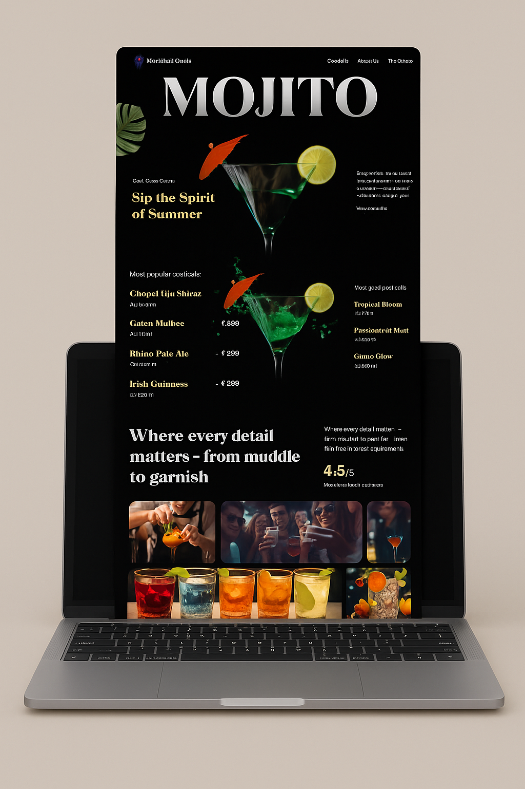

# Mocktail Oasis 🍹

**Mocktail Oasis** is a modern, scroll-driven landing page for cocktails and mocktails, built with **React**, **Tailwind CSS**, **GSAP**, and **Vite**. This project was built to learn and experiment with **GSAP**’s powerful animation tools and advanced scroll-based effects.

---
## 📸 Mockup Preview

Here’s a sneak peek at **Mocktail Oasis** in action — smooth scroll animations, lush parallax effects, and an elegant, modern layout:

  

## ⚡ Tech Stack

- **React** — Declarative component-based UI
- **Tailwind CSS** — Utility-first responsive styling
- **GSAP** — Advanced animations and scroll interactions
- **Vite** — Fast build tool and development server

---

## ✨ Key Features

- SplitText reveals for dynamic text animations
- ScrollTrigger for scroll-driven timeline control
- Parallax scrolling for immersive depth
- Pinned sections for engaging scroll experiences
- Scroll-synced video playback
- Scroll-based image masking effects
- Custom animated carousel
- Seamless timeline animations across sections
- Fully responsive, modern UI

---

## 📄 License

This project is for learning purposes only.
